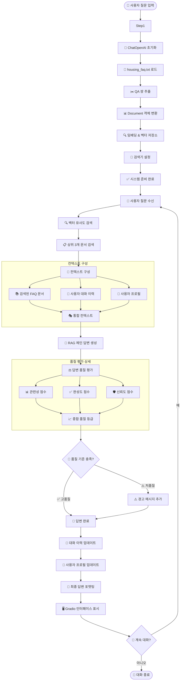
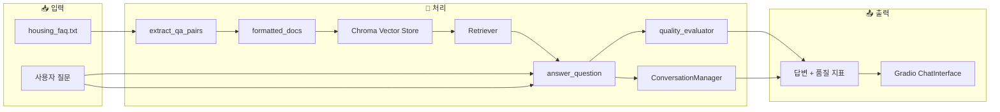
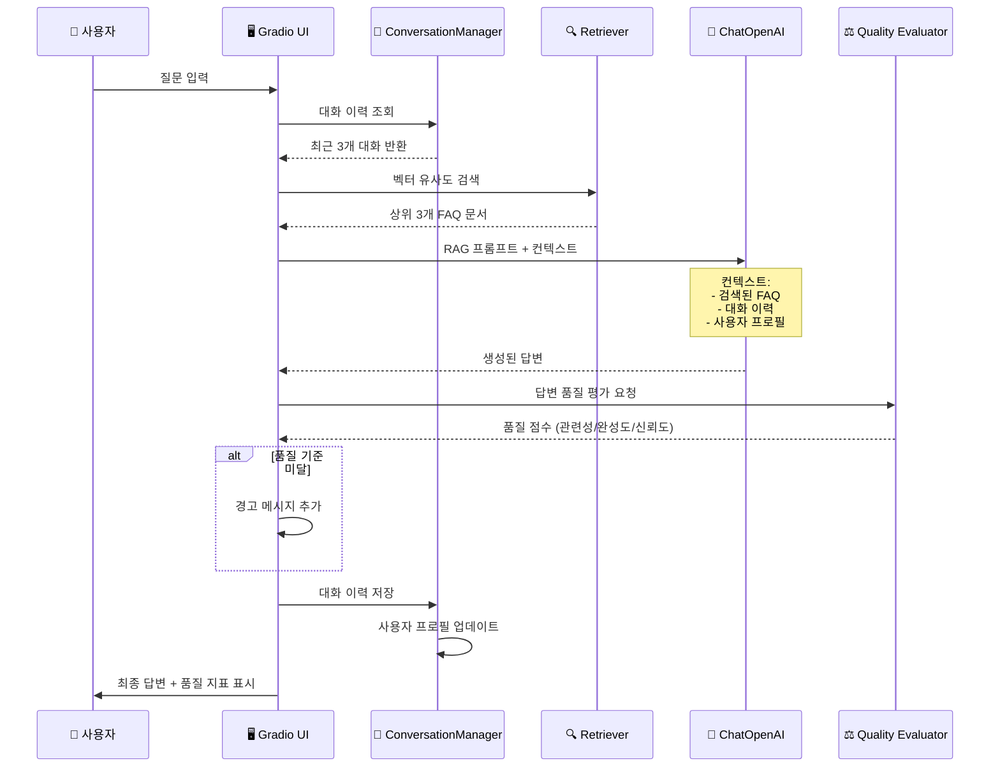
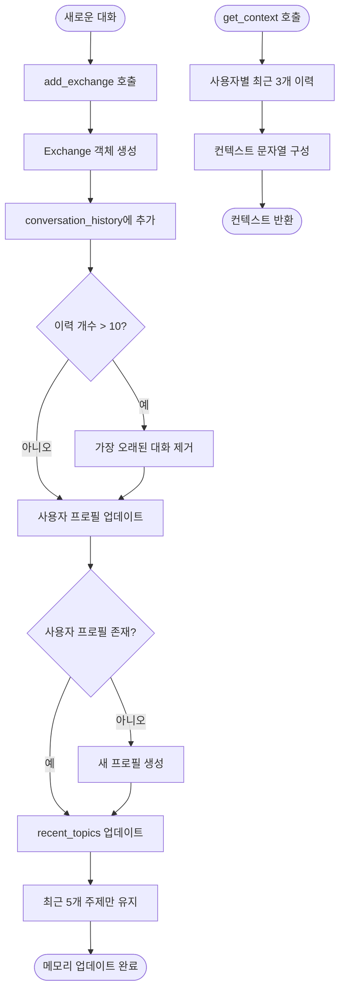

## AI Flow

```mermaid
flowchart TD
    Start([👤 사용자 질문 입력]) --> Step1
    
    %% 초기화 단계
    Step1 --> Step2[🧠 ChatOpenAI 초기화]
    Step2 --> Step3[📄 housing_faq.txt 로드]
    Step3 --> Step4[✂️ QA 쌍 추출]
    Step4 --> Step5[📊 Document 객체 변환]
    Step5 --> Step6[🔍 임베딩 & 벡터 저장소]
    Step6 --> Step7[🎯 검색기 설정]
    Step7 --> Ready[✅ 시스템 준비 완료]
    
    %% 질문 처리 플로우
    Ready --> UserInput[💬 사용자 질문 수신]
    
    UserInput --> SearchStep[🔍 벡터 유사도 검색]
    SearchStep --> Retrieved[📋 상위 3개 문서 검색]
    
    Retrieved --> ContextBuild[🧩 컨텍스트 구성]
    
    %% 컨텍스트 구성 상세
    subgraph "컨텍스트 구성"
        ContextBuild --> CB1[📚 검색된 FAQ 문서]
        ContextBuild --> CB2[💭 사용자 대화 이력]
        ContextBuild --> CB3[👤 사용자 프로필]
        CB1 --> ContextReady[🎭 통합 컨텍스트]
        CB2 --> ContextReady
        CB3 --> ContextReady
    end
    
    ContextReady --> Generate[🎨 RAG 체인 답변 생성]
    
    %% 품질 평가 단계
    Generate --> QualityCheck[⚖️ 답변 품질 평가]
    
    subgraph "품질 평가 상세"
        QualityCheck --> Q1[📊 관련성 점수]
        QualityCheck --> Q2[✅ 완성도 점수]
        QualityCheck --> Q3[🛡️ 신뢰도 점수]
        Q1 --> QualityResult[📈 종합 품질 등급]
        Q2 --> QualityResult
        Q3 --> QualityResult
    end
    
    QualityResult --> QualityGate{🚦 품질 기준 충족?}
    
    %% 품질에 따른 분기
    QualityGate -->|✅ 고품질| GoodAnswer[🌟 답변 완료]
    QualityGate -->|⚠️ 저품질| AddWarning[⚠️ 경고 메시지 추가]
    AddWarning --> GoodAnswer
    
    %% 이력 관리
    GoodAnswer --> UpdateHistory[💾 대화 이력 업데이트]
    UpdateHistory --> UpdateProfile[👤 사용자 프로필 업데이트]
    UpdateProfile --> FormatOutput[🎨 최종 답변 포맷팅]
    
    %% UI 출력
    FormatOutput --> UIDisplay[🖥️ Gradio 인터페이스 표시]
    UIDisplay --> Continue{🔄 계속 대화?}
    
    Continue -->|예| UserInput
    Continue -->|아니오| End([👋 대화 종료])
```

## Data Flow

```mermaid
graph LR
    subgraph "📥 입력"
        A1[housing_faq.txt]
        A2[사용자 질문]
    end
    
    subgraph "🔄 처리"
        B1[extract_qa_pairs] --> B2[formatted_docs]
        B2 --> B3[Chroma Vector Store]
        B3 --> B4[Retriever]
        
        A2 --> B5[answer_question]
        B4 --> B5
        B5 --> B6[quality_evaluator]
        B5 --> B7[ConversationManager]
    end
    
    subgraph "📤 출력"
        C1[답변 + 품질 지표]
        C2[Gradio ChatInterface]
    end
    
    A1 --> B1
    A2 --> B5
    B6 --> C1
    B7 --> C1
    C1 --> C2
```

## 추론과정

```mermaid
sequenceDiagram
    participant User as 👤 사용자
    participant UI as 🖥️ Gradio UI
    participant Conv as 💭 ConversationManager
    participant Ret as 🔍 Retriever
    participant LLM as 🧠 ChatOpenAI
    participant Qual as ⚖️ Quality Evaluator
    
    User->>UI: 질문 입력
    UI->>Conv: 대화 이력 조회
    Conv-->>UI: 최근 3개 대화 반환
    
    UI->>Ret: 벡터 유사도 검색
    Ret-->>UI: 상위 3개 FAQ 문서
    
    UI->>LLM: RAG 프롬프트 + 컨텍스트
    Note over LLM: 컨텍스트:<br/>- 검색된 FAQ<br/>- 대화 이력<br/>- 사용자 프로필
    LLM-->>UI: 생성된 답변
    
    UI->>Qual: 답변 품질 평가 요청
    Qual-->>UI: 품질 점수 (관련성/완성도/신뢰도)
    
    alt 품질 기준 미달
        UI->>UI: 경고 메시지 추가
    end
    
    UI->>Conv: 대화 이력 저장
    Conv->>Conv: 사용자 프로필 업데이트
    
    UI->>User: 최종 답변 + 품질 지표 표시
```

## 메모리 관리

```mermaid
flowchart TD
    NewChat([새로운 대화]) --> AddExchange[add_exchange 호출]
    
    AddExchange --> CreateExchange[Exchange 객체 생성]
    CreateExchange --> AddToHistory[conversation_history에 추가]
    
    AddToHistory --> CheckLimit{이력 개수 > 10?}
    CheckLimit -->|예| RemoveOldest[가장 오래된 대화 제거]
    CheckLimit -->|아니오| UpdateProfile[사용자 프로필 업데이트]
    RemoveOldest --> UpdateProfile
    
    UpdateProfile --> CheckUserExists{사용자 프로필 존재?}
    CheckUserExists -->|아니오| CreateProfile[새 프로필 생성]
    CheckUserExists -->|예| UpdateTopics[recent_topics 업데이트]
    CreateProfile --> UpdateTopics
    
    UpdateTopics --> LimitTopics[최근 5개 주제만 유지]
    LimitTopics --> Complete([메모리 업데이트 완료])
    
    %% 컨텍스트 조회 플로우
    GetContext([get_context 호출]) --> FilterHistory[사용자별 최근 3개 이력]
    FilterHistory --> BuildContext[컨텍스트 문자열 구성]
    BuildContext --> ReturnContext([컨텍스트 반환])
```