# AI ETF 추천 시스템

LangGraph 기반 맞춤형 ETF 포트폴리오 추천 시스템

## 시스템 개요

본 시스템은 사용자의 투자 프로필을 분석하여 최적의 ETF 포트폴리오를 추천하는 AI 기반 추천 엔진입니다. Text2SQL, RAG(Retrieval-Augmented Generation), LangGraph를 활용한 멀티 에이전트 워크플로우로 구성되어 있습니다.

### 핵심 기능

- **투자 프로필 자동 분석**: 자연어 질문에서 위험 성향, 투자 기간, 선호 섹터 등 추출
- **정밀 ETF 검색**: Text2SQL + RAG 기반 고유명사 매칭으로 정확한 ETF 검색
- **종합 평가 및 순위 매김**: 수익률, 안정성, 비용, 프로필 적합성을 종합 평가
- **포트폴리오 다양성 분석**: 섹터 분산, 위험 분산 등 다각도 분석
- **구체적인 투자 가이드**: 투자 비중, 위험 요소, 고려사항 제공

## 시스템 아키텍처

### 전체 구조

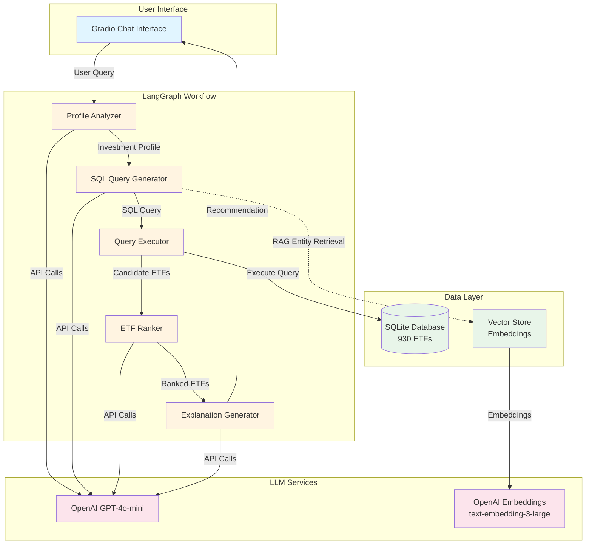

### 워크플로우 상세

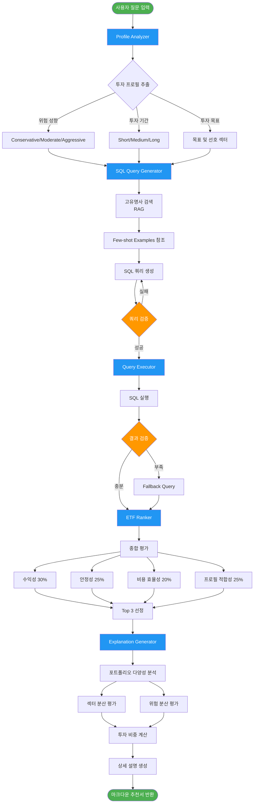

## 데이터베이스 스키마

### ETFs 테이블

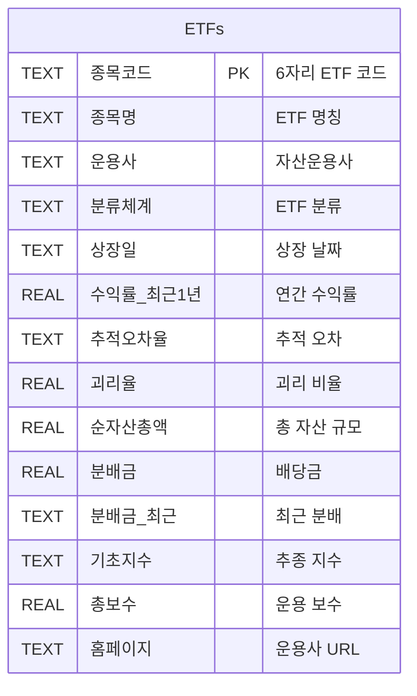

### 데이터 통계

| 항목 | 값 |
|------|-----|
| 총 ETF 수 | 930개 |
| 운용사 수 | 다수 |
| 분류 체계 | 주식형, 채권형, 혼합형, 특별자산형 등 |
| 기초 지수 | 국내외 주요 지수 포함 |

## 핵심 개선 사항

### 1. Few-shot Learning 기반 Text2SQL

기존 시스템 대비 SQL 생성 정확도 향상을 위해 Few-shot 예제 추가

```python
예제 1: IT 섹터 검색
예제 2: 배당 ETF 검색
예제 3: 미국 시장 ETF 검색
```

### 2. 쿼리 검증 및 재시도 메커니즘

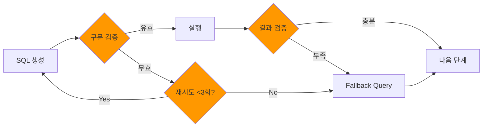

### 3. 포트폴리오 다양성 분석

선정된 ETF의 분산 투자 품질 평가

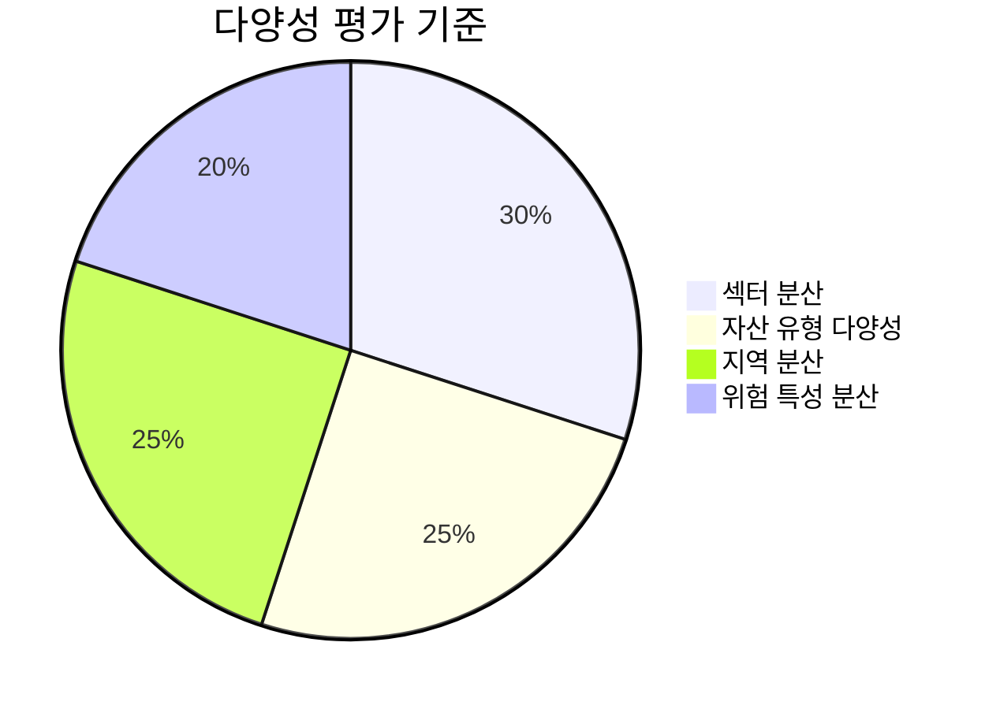

### 4. 투자 성향별 평가 가중치

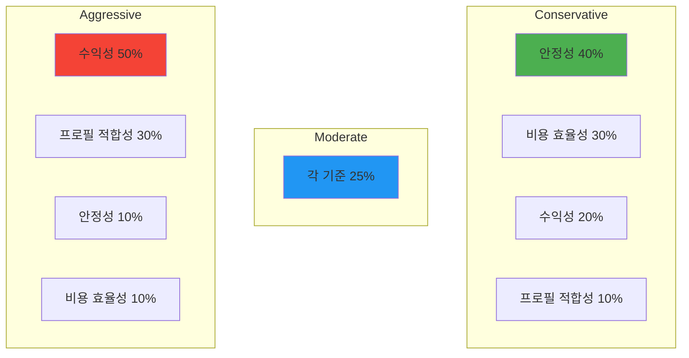

### 5. RAG 기반 고유명사 검색

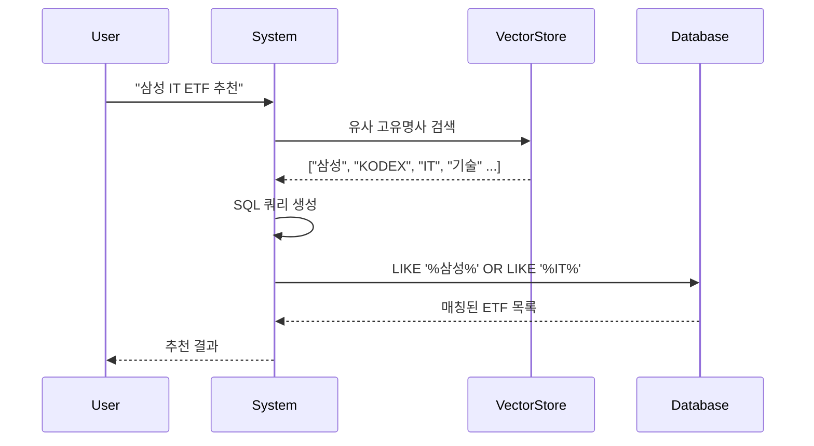

## 빠른 시작

### 문서 읽는 순서

1. **docs/00_START_HERE.md** - 여기서 시작하세요!
2. **docs/SUMMARY.md** - 프로젝트 전체 요약
3. **docs/DEPLOYMENT.md** - 허깅페이스 배포 가이드
4. **docs/USAGE_GUIDE.md** - 상세 사용법

### 로컬 환경 실행

```bash
# 1. 저장소 클론
git clone <repository-url>
cd hf-etf-bot

# 2. 가상환경 생성 (권장)
python -m venv venv
venv\Scripts\activate  # Windows
source venv/bin/activate  # Linux/Mac

# 3. 의존성 설치
pip install -r requirements.txt

# 4. 환경 변수 설정
copy .env.example .env
# .env 파일을 열어 OPENAI_API_KEY 입력

# 5. 애플리케이션 실행
python app.py
```

### 허깅페이스 스페이스 배포

**상세한 배포 가이드는 `docs/DEPLOYMENT.md`를 참조하세요.**

간단 요약:
1. Hugging Face Spaces에서 새 Space 생성 (Gradio 선택)
2. 필수 파일 업로드: `app.py`, `requirements.txt`, `etf_database.db`, `README.md`
3. Settings에서 환경 변수 추가: `OPENAI_API_KEY`
4. 빌드 완료 대기 (3-5분)

자세한 내용과 문제 해결은 `docs/DEPLOYMENT.md` 참조

## 사용 방법

### 입력 예시

```
30대 직장인입니다. 월 100만원 정도를 3년 이상 장기 투자하고 싶고,
IT와 헬스케어 섹터를 선호합니다. 보수적인 투자를 선호하며,
담배나 무기 관련 기업은 제외하고 싶습니다.
```

### 출력 구조

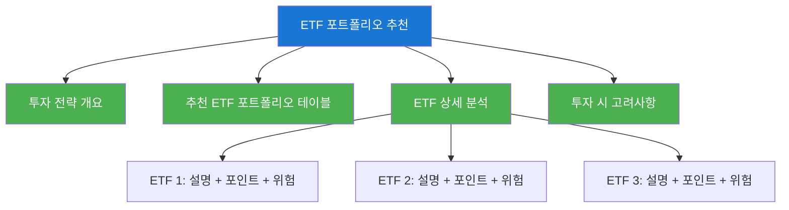

## 기술 스택

### 프레임워크 및 라이브러리

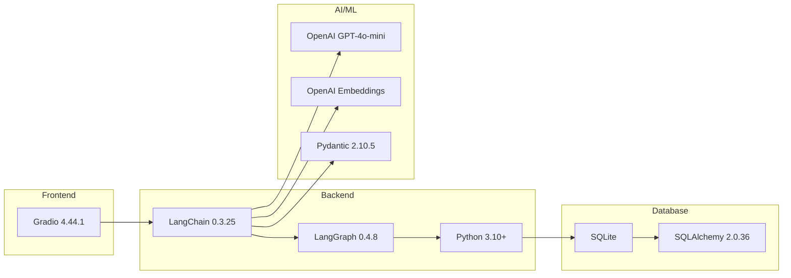

### 주요 의존성

| 라이브러리 | 버전 | 용도 |
|-----------|------|------|
| gradio | 4.44.1 | 웹 인터페이스 |
| langchain | 0.3.25 | LLM 프레임워크 |
| langgraph | 0.4.8 | 워크플로우 오케스트레이션 |
| langchain-openai | 0.3.21 | OpenAI 통합 |
| pydantic | 2.10.5 | 데이터 검증 |
| python-dotenv | 1.1.0 | 환경 변수 관리 |

## 파일 구조

```
hf-etf-bot/
├── app.py                   # 메인 애플리케이션
├── config.py                # 설정 파일
├── requirements.txt         # 의존성 목록
├── etf_database.db          # SQLite 데이터베이스 (930 ETFs)
├── .env.example             # 환경 변수 템플릿
├── .gitignore               # Git 제외 파일
├── test_db.py               # 데이터베이스 검증 스크립트
├── README.md                # 본 문서 (시스템 개요)
└── docs/                    # 상세 문서 모음
    ├── 00_START_HERE.md     # 시작 가이드
    ├── SUMMARY.md           # 프로젝트 요약
    ├── DEPLOYMENT.md        # 배포 가이드
    ├── USAGE_GUIDE.md       # 사용 가이드
    ├── CHECKLIST.md         # 배포 체크리스트
    └── CHANGELOG.md         # 변경 이력
```

## 성능 최적화

### 응답 시간 구조

```mermaid
gantt
    title ETF 추천 프로세스 소요 시간 (평균)
    dateFormat  s
    section Analysis
    프로필 분석       :a1, 0, 2s
    section Query
    SQL 생성 + RAG   :a2, 2, 3s
    쿼리 실행        :a3, 5, 1s
    section Ranking
    후보 평가        :a4, 6, 3s
    다양성 분석      :a5, 9, 2s
    section Output
    설명 생성        :a6, 11, 3s
```

총 예상 소요 시간: **약 10-15초**

## 한계 및 고려사항

### 현재 한계

1. **실시간 시장 데이터 미반영**: 정적 데이터베이스 사용
2. **백테스팅 부재**: 과거 성과 검증 기능 없음
3. **포트폴리오 리밸런싱 미제공**: 초기 추천만 제공
4. **거래 비용 미고려**: 매매 수수료 등 미포함

### 향후 개선 방향

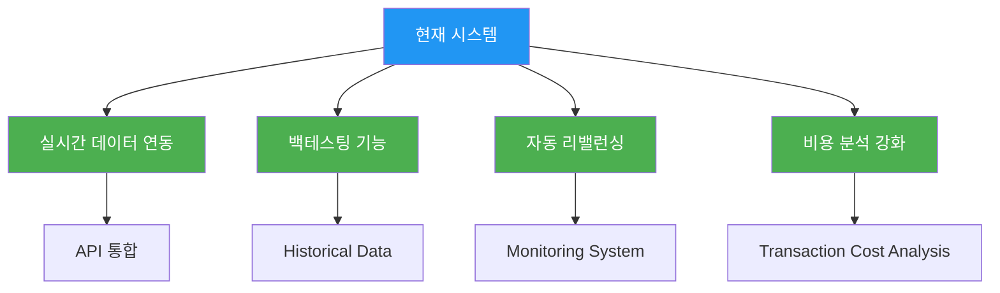

## 라이센스

본 프로젝트는 교육 및 연구 목적으로 제작되었습니다.

## 면책 조항

본 시스템의 추천은 AI 기반 분석 결과이며, 투자 결정에 대한 법적 책임을 지지 않습니다. 실제 투자 시에는 반드시 추가적인 조사와 전문가 상담을 권장합니다.

---

**개발 일자**: 2025년
**기술 스택**: Python, LangChain, LangGraph, Gradio, OpenAI GPT-4o-mini
**데이터**: 한국 ETF 시장 930개 종목
