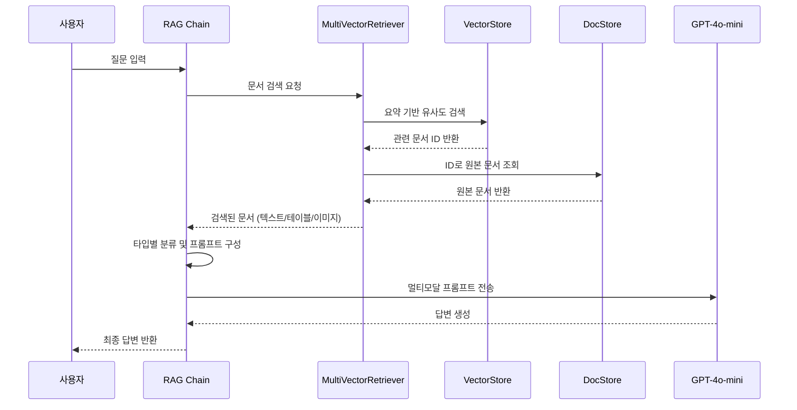

# Docling 기반 멀티모달 RAG 시스템 플로우

```mermaid
flowchart TD
    Start([멀티모달 RAG 시스템 시작]) --> LoadPDF

    %% 데이터 로딩 단계
    subgraph DataLoading["데이터 로딩 및 파싱"]
        LoadPDF[PDF 파일 로드]
        LoadPDF --> Converter{DocumentConverter 초기화}
        Converter --> |"PdfPipelineOptions<br/>images_scale=2.0<br/>generate_page_images=True"| ExtractAll[문서 변환 및 추출]
        ExtractAll --> Chunker{HybridChunker}
        Chunker --> |"tokenizer='BAAI/bge-m3'<br/>max_tokens=8000"| ChunkResult[청킹 완료]
    end

    %% 1단계: 데이터 준비
    subgraph Step1["1단계: 데이터 준비"]
        ChunkResult --> SplitData[타입별 데이터 분리]
        SplitData --> TextChunks[텍스트 청크 수집<br/>metadata: source, chunk_index, pages]
        SplitData --> Tables[테이블 수집<br/>markdown 형식<br/>metadata: source, page_no]
        SplitData --> Images[페이지 이미지 수집<br/>base64 형식<br/>metadata: source, page_no, width, height]
    end

    %% 2-4단계: 요약 생성
    subgraph Step2_4["2-4단계: 요약 생성"]
        TextChunks --> TextSumm{텍스트 요약 생성}
        TextSumm --> |"ChatOpenAI<br/>model='gpt-4o-mini'<br/>핵심 내용 및 주요 수치 요약"| TextSummResult[텍스트 요약 완료]

        Tables --> TableSumm{테이블 요약 생성}
        TableSumm --> |"ChatOpenAI<br/>model='gpt-4o-mini'<br/>주요 수치 및 패턴 분석"| TableSummResult[테이블 요약 완료]

        Images --> ImgSumm{이미지 요약 생성}
        ImgSumm --> |"ChatOpenAI (Multimodal)<br/>model='gpt-4o-mini'<br/>이미지 분석 및 비즈니스 의미 추출"| ImgSummResult[이미지 요약 완료]
    end

    %% 5단계: MultiVectorRetriever 초기화
    subgraph Step5["5단계: MultiVectorRetriever 초기화"]
        TextSummResult --> InitRetriever
        TableSummResult --> InitRetriever
        ImgSummResult --> InitRetriever
        InitRetriever[Retriever 초기화] --> VectorStore{Chroma VectorStore}
        VectorStore --> |"collection='docling_multimodal_rag'<br/>embedding='text-embedding-3-small'<br/>persist_directory='./docling_chroma_db'"| VS_Created[벡터스토어 생성]
        InitRetriever --> DocStore{InMemoryStore}
        DocStore --> DS_Created[문서스토어 생성]
        VS_Created --> MVRetriever[MultiVectorRetriever]
        DS_Created --> MVRetriever
    end

    %% 6-8단계: 문서 추가
    subgraph Step6_8["6-8단계: 문서 추가"]
        MVRetriever --> AddText[텍스트 추가]
        AddText --> |"요약 → VectorStore<br/>원본 텍스트 → DocStore"| TextAdded[텍스트 저장 완료]

        MVRetriever --> AddTable[테이블 추가]
        AddTable --> |"요약 → VectorStore<br/>원본 마크다운 → DocStore"| TableAdded[테이블 저장 완료]

        MVRetriever --> AddImage[이미지 추가]
        AddImage --> |"요약 → VectorStore<br/>원본 base64 → DocStore"| ImageAdded[이미지 저장 완료]

        TextAdded --> StoreReady[벡터스토어 구성 완료]
        TableAdded --> StoreReady
        ImageAdded --> StoreReady
    end

    %% 9-10단계: RAG 체인 구성
    subgraph Step9_10["9-10단계: RAG 체인 구성"]
        StoreReady --> PromptFunc[프롬프트 처리 함수 정의]
        PromptFunc --> |"docling_process_prompt()<br/>- 타입별 문서 분류<br/>- 텍스트 컨텍스트 구성<br/>- 이미지 추가"| FuncDefined[함수 정의 완료]

        FuncDefined --> BuildChain[RAG 체인 구성]
        BuildChain --> BasicChain["기본 체인<br/>context: retriever<br/>question: passthrough"]
        BuildChain --> SourceChain["소스 포함 체인<br/>response + context 반환"]

        BasicChain --> ChainReady[RAG 체인 준비 완료]
        SourceChain --> ChainReady
    end

    %% 11-14단계: 테스트 및 비교
    subgraph Step11_14["11-14단계: 테스트 질의"]
        ChainReady --> Query1{질문 1: 기본 질문}
        Query1 --> |"텍스트 검색<br/>실적 전망 질문"| Answer1[답변 생성]

        ChainReady --> Query2{질문 2: 소스 포함}
        Query2 --> |"재무 지표 질문<br/>메타데이터 포함 반환"| Answer2[답변 + 소스 반환]

        ChainReady --> Query3{질문 3: 이미지 포함}
        Query3 --> |"차트/그래프 트렌드<br/>멀티모달 처리"| Answer3[답변 + 이미지 표시]

        Answer1 --> Compare[옵션 2 vs 옵션 3 비교]
        Answer2 --> Compare
        Answer3 --> Compare
    end

    Compare --> End([시스템 완료])

    %% 스타일 정의
    classDef summaryStyle fill:#fff9c4,stroke:#f57f17,stroke-width:2px
    classDef storeStyle fill:#e1f5fe,stroke:#01579b,stroke-width:2px
    classDef chainStyle fill:#f3e5f5,stroke:#4a148c,stroke-width:2px
    classDef testStyle fill:#e8f5e9,stroke:#1b5e20,stroke-width:2px

    class TextSumm,TableSumm,ImgSumm summaryStyle
    class VectorStore,DocStore,MVRetriever storeStyle
    class PromptFunc,BuildChain,BasicChain,SourceChain chainStyle
    class Query1,Query2,Query3,Compare testStyle
```



## 주요 단계 설명

### 데이터 로딩 및 파싱
- **DocumentConverter**: Docling의 PDF 변환기
- **PdfPipelineOptions**: 이미지 스케일 2.0 (144 DPI), 페이지 이미지 생성
- **HybridChunker**: 토큰 기반 청킹 (최대 8000 토큰)

### 1단계: 데이터 준비
- 텍스트 청크, 테이블, 페이지 이미지로 분리
- 각 타입별 메타데이터 수집

### 2-4단계: 요약 생성
- **텍스트**: GPT-4o-mini로 핵심 내용 요약
- **테이블**: GPT-4o-mini로 주요 수치 분석
- **이미지**: GPT-4o-mini (멀티모달)로 시각적 내용 분석

### 5단계: MultiVectorRetriever 초기화
- **VectorStore**: 요약 텍스트를 임베딩하여 저장
- **DocStore**: 원본 데이터 (텍스트/테이블/이미지) 저장
- ID 키로 연결

### 6-8단계: 문서 추가
- 요약은 벡터스토어에 (검색용)
- 원본은 docstore에 (컨텍스트 제공용)
- UUID로 매핑

### 9-10단계: RAG 체인 구성
- 타입별 문서 분류 및 프롬프트 구성
- 이미지가 있을 경우 멀티모달 프롬프트 생성
- 기본 체인 / 소스 포함 체인 제공

### 11-14단계: 테스트 질의
- 텍스트 검색 테스트
- 소스 메타데이터 확인
- 멀티모달 (이미지 포함) 질의
- 옵션 2 vs 옵션 3 비교

## 옵션 비교

### 옵션 2 (Unstructured)
- 제목 기반 청킹 (의미 단위)
- 문서 내 이미지/테이블 블록 추출
- HTML 형식 테이블

### 옵션 3 (Docling)
- 토큰 기반 청킹 (길이 제어)
- 페이지 전체 이미지 (레이아웃 보존)
- Markdown 형식 테이블
```

## 데이터 흐름도



## 핵심 특징

1. **이중 저장 구조**
   - 요약: 효율적인 검색
   - 원본: 풍부한 컨텍스트

2. **멀티모달 처리**
   - 텍스트, 테이블, 이미지 통합
   - 타입별 최적화된 처리

3. **유연한 청킹**
   - HybridChunker로 토큰 기반 제어
   - 의미 보존 및 길이 관리

4. **확장 가능한 구조**
   - 새로운 문서 타입 추가 용이
   - 커스텀 요약 전략 적용 가능
